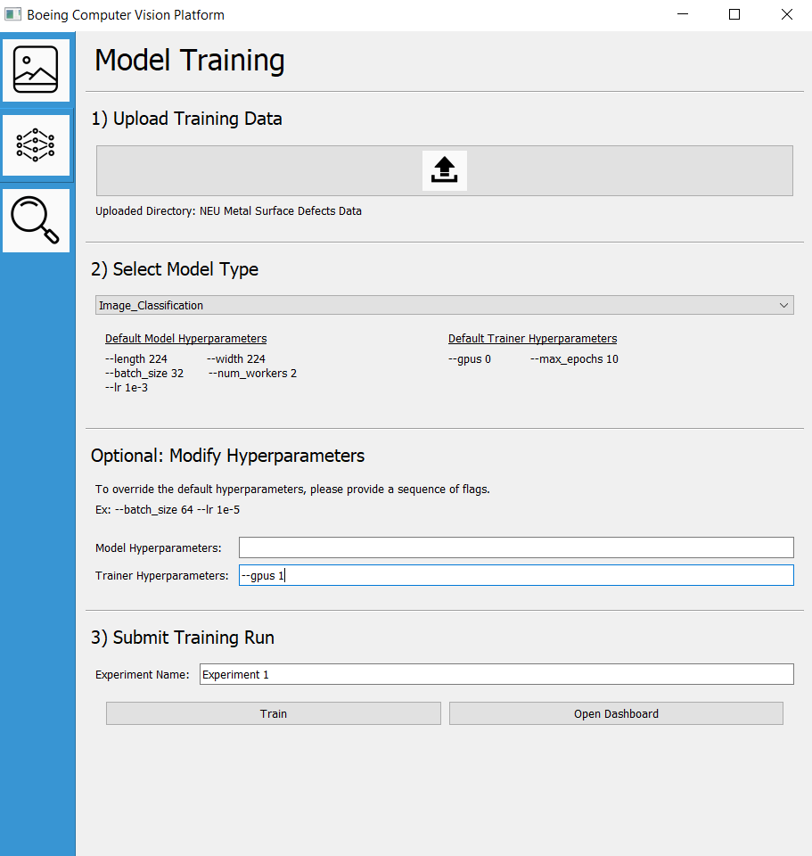
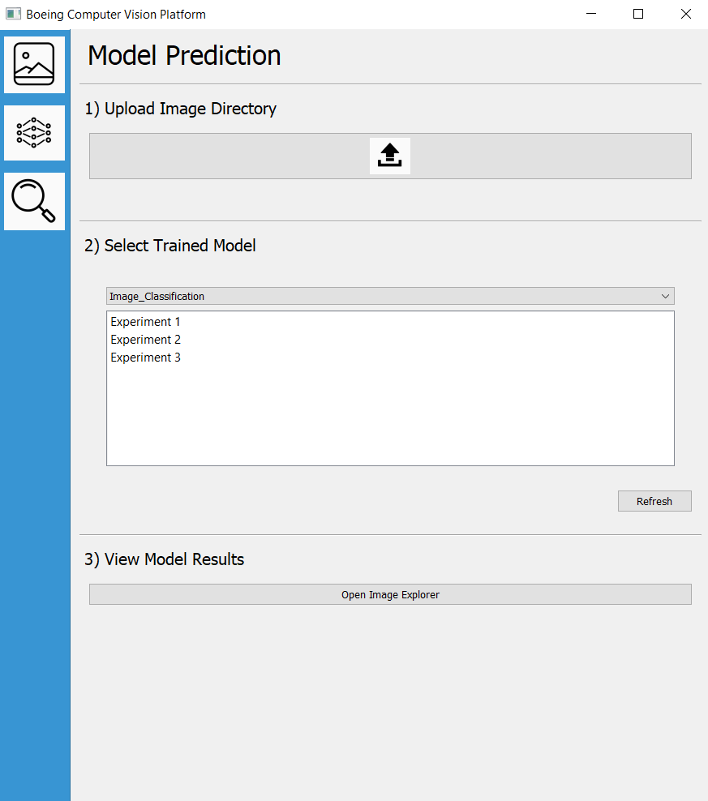
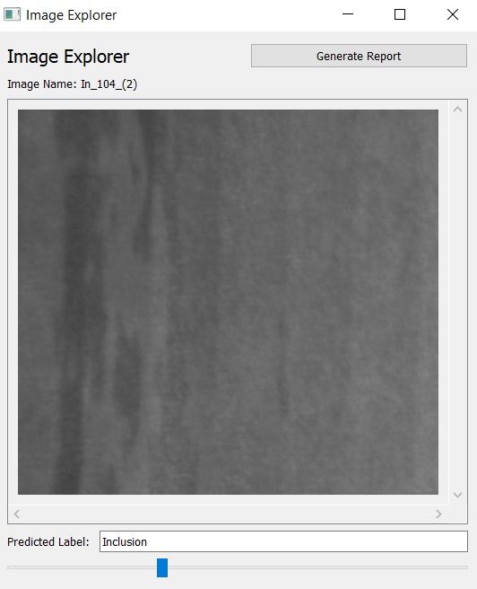

# ml-platform 
Low-Code ML-Platform for Computer Vision in collaboration with Boeing.  

## Motivation 
This project automates model training of image classification and object detection models in an end-to-end manner. <br>
Simply provide the training data and platform handles the rest!

## Installation 
### Windows: 
Install [Python](https://www.python.org/downloads/), [Git](https://git-scm.com/downloads) 

Clone Repository and Setup Application Environment: 
```bash
git clone https://github.com/JWongDude/ml-platform.git
python -m venv .venv

.venv/Scripts/Activate.ps1  # Powershell 
source .venv/Scripts/activate  # Shell

pip install -r requirements.txt
python app.py 
```

## Usage
### Windows:
Navigate to Project Directory `cd <path/to/project/directory>`, <br>
activate virtualenv if needed `./venv/Scripts/activate`, <br>
and run entrypoint `python app.py`.<br>

If your computer has a GPU, please head to the official [Pytorch](https://pytorch.org/get-started/locally/) website 
and retrieve the pytorch version compatible with your hardware. Install this pytorch into your virtual environment.

```bash 
# Ex, for CUDA 10.2, run the following: 
pip3 install torch==1.8.1+cu102 torchvision==0.9.1+cu102 torchaudio===0.8.1 -f https://download.pytorch.org/whl/torch_stable.html
```

## Platform Tour
### Model Training Panel 


### Model Prediction Panel 


### Image Explorer
